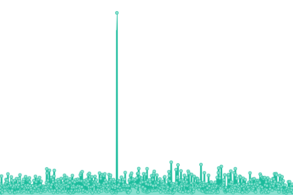
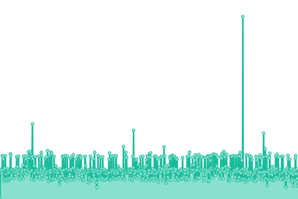
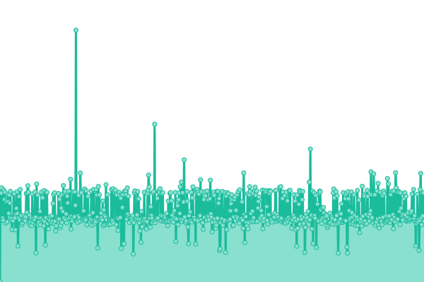
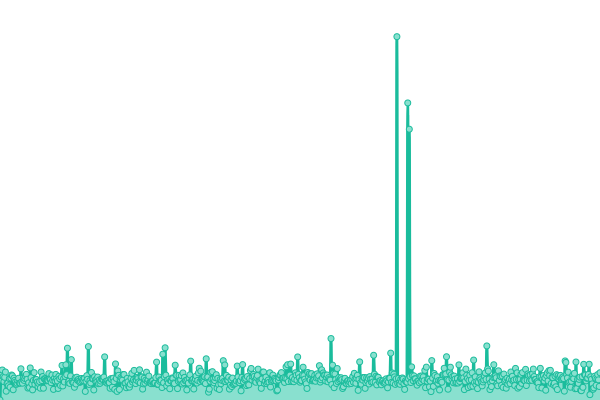
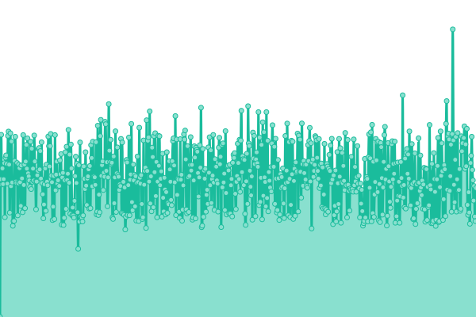
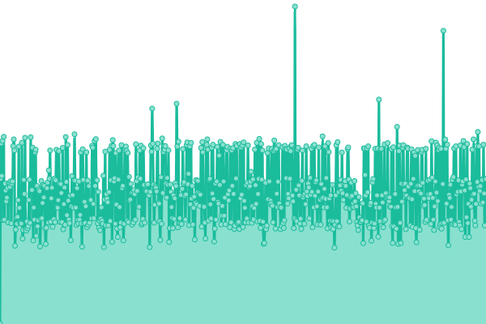

# [📈 Live Status](https://six-star-connect.github.io/status-monitor): <!--live status--> **🟩 All systems operational**

This repository contains the open-source uptime monitor and status page for [Six Star Global](https://six-star-connect.github.io/status-monitor), powered by [Upptime](https://github.com/upptime/upptime).

With [Upptime](https://upptime.js.org), you can get your own unlimited and free uptime monitor and status page, powered entirely by a GitHub repository. We use [Issues](https://github.com/six-star-connect/status-monitor/issues) as incident reports, [Actions](https://github.com/six-star-connect/status-monitor/actions) as uptime monitors, and [Pages](https://six-star-connect.github.io/status-monitor) for the status page.

<!--start: status pages-->
<!-- This summary is generated by Upptime (https://github.com/upptime/upptime) -->
<!-- Do not edit this manually, your changes will be overwritten -->
<!-- prettier-ignore -->
| URL | Status | History | Response Time | Uptime |
| --- | ------ | ------- | ------------- | ------ |
|  [Manage](https://manage.sixstar.support) | 🟩 Up | [manage.yml](https://github.com/six-star-connect/status-monitor/commits/HEAD/history/manage.yml) | 

 272ms
     
 | 

<a href="https://status.sixstar.support/history/manage">100.00%</a>
    

|  [API](https://api.sixstar.click) | 🟩 Up | [api.yml](https://github.com/six-star-connect/status-monitor/commits/HEAD/history/api.yml) | 

 653ms
     
 | 

<a href="https://status.sixstar.support/history/api">100.00%</a>
    

|  [N8N](https://n8n.sixstar.click) | 🟩 Up | [n8-n.yml](https://github.com/six-star-connect/status-monitor/commits/HEAD/history/n8-n.yml) | 

 412ms
     
 | 

<a href="https://status.sixstar.support/history/n8-n">100.00%</a>
    

|  [Six Star Global](https://sixstar.global) | 🟩 Up | [six-star-global.yml](https://github.com/six-star-connect/status-monitor/commits/HEAD/history/six-star-global.yml) | 

 808ms
     
 | 

<a href="https://status.sixstar.support/history/six-star-global">100.00%</a>
    

|  [ITGlue](https://six-star.eu.itglue.com) | 🟩 Up | [it-glue.yml](https://github.com/six-star-connect/status-monitor/commits/HEAD/history/it-glue.yml) | 

 1126ms
     
 | 

<a href="https://status.sixstar.support/history/it-glue">100.00%</a>
    

|  [3CX](https://sixstar.3cx.uk:5001) | 🟩 Up | [3-cx.yml](https://github.com/six-star-connect/status-monitor/commits/HEAD/history/3-cx.yml) | 

 573ms
     
 | 

<a href="https://status.sixstar.support/history/3-cx">100.00%</a>
    

<!--end: status pages-->

[**Visit our status website →**](https://six-star-connect.github.io/status-monitor)

## 📄 License

- Powered by: [Upptime](https://github.com/upptime/upptime)
- Code: [MIT](./LICENSE) © [Anand Chowdhary](https://anandchowdhary.com), supported by [Pabio](https://pabio.com)
- Data in the `./history` directory: [Open Database License](https://opendatacommons.org/licenses/odbl/1-0/)
